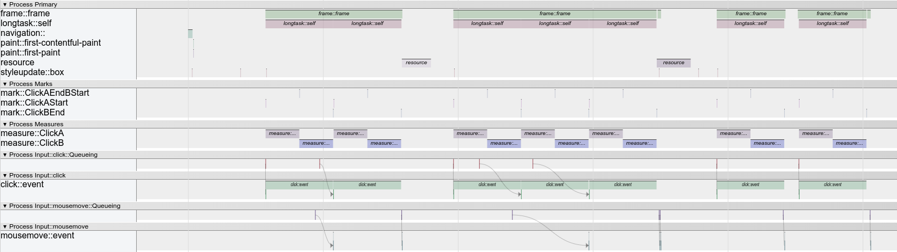

# Performance Observer Tracing
Fetch traces from the wild.

The demo [here](https://tdresser.github.io/performance-observer-tracing/) contains a box with a slow click handler, a button to fetch resources, and a button to download a trace, containing the information recorded by a PerformanceObserver.

[Here](sample_trace.json)'s a sample trace.

## Usage

Include this script in the page early enough for the PerformanceObserver to observe all target entries.
The following globals are exposed.

### `downloadPerformanceObserverTrace()`

Downloads the generated `.trace.json` file to disk. This trace can be loaded into `chrome://tracing/`. 	

### `getPerformanceObserverTrace()`

Returns a string that can be saved to a `.trace.json` file.

### `getPerformanceObserverTraceEvents()`

Returns an array of the synthesized trace event objects.
